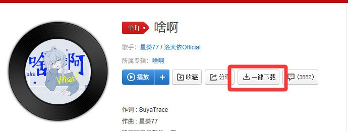

# 网易云音乐一键下载

为方便下载网易云音乐歌曲而制作的浏览器扩展。

## 背景

网易云音乐网页版虽然提供了音乐播放功能，但下载功能受限。本扩展旨在简化下载流程，让用户能够一键获取歌曲下载链接。

## 功能特性

- 🔍 自动识别网易云音乐歌曲页面
- 📋 一键复制歌曲下载链接
- ⬇️ 自动触发浏览器下载
- 🎵 支持标准音质 MP3 下载

## 如何安装

### 开发者模式安装

1. 下载本仓库代码到本地
2. 打开 Chrome/Edge 浏览器，进入扩展管理页面
   - Chrome: `chrome://extensions/`
   - Edge: `edge://extensions/`
3. 开启右上角的"开发者模式"
4. 点击"加载已解压的扩展程序"
5. 选择项目文件夹

## 如何使用

### 方法一：使用劫持按钮

本插件劫持了原下载按钮
1. 安装扩展后，打开 [网易云音乐网页版](https://music.163.com)
2. 进入任意歌曲详情页面，如[《啥啊》](https://music.163.com/#/song?id=1963526955)
3. 点击分享按钮旁的"一键下载"按钮

4. 会自动触发下载mp3文件

### 方法二：使用弹窗下载

1. 安装扩展后，打开 [网易云音乐网页版](https://music.163.com)
2. 进入任意歌曲详情页面
3. 点击浏览器工具栏上的扩展图标
4. 点击"一键下载当前歌曲"按钮

5. 链接会自动复制到剪贴板，并触发下载

## 实现原理

通过解析网易云音乐网页版 URL 中的歌曲 ID，拼接外链下载地址：

```
http://music.163.com/song/media/outer/url?id={歌曲ID}.mp3
```

## 局限性

- ⚠️ 网易云返回的是什么音质，就只能下载什么音质
- ⚠️ 部分版权受限歌曲可能无法下载
- ⚠️ 需要登录网易云音乐账号才能下载歌曲
- ⚠️ 下载成功率受网易云音乐服务器限制影响

## 致谢

- [按钮波浪动画样式代码](https://www.bilibili.com/read/cv25883668/?spm_id_from=333.788&opus_fallback=1)来自 [**B站：山羊の前端小窝**（UID:266664645）](https://space.bilibili.com/266664645)

## 维护说明

这个仓库的代码支持是尽力而为的，如果您有更好的建议或者提案请随时提交 Issue 或 PR :)

## ⚠️ 免责声明

### 使用声明

1. **本扩展仅供学习交流使用**，请勿用于商业用途或任何违反法律法规的活动。

2. **版权尊重**：下载的音乐版权归原著作权人所有。本扩展仅提供技术便利，不存储、不传播任何音乐内容。用户应遵守《中华人民共和国著作权法》等相关法律法规，仅将下载内容用于个人学习、研究或欣赏，不得用于商业用途或公开传播。

3. **账号安全**：使用本扩展可能导致网易云音乐账号受到限制或封禁，开发者对此不承担任何责任。

4. **服务可用性**：网易云音乐可能随时更改其 API 或下载机制，导致本扩展失效。开发者不保证扩展的持续可用性。

### 法律责任豁免

**使用本扩展即表示您同意以下条款：**

1. 开发者对因使用本扩展而产生的任何直接或间接损失不承担责任，包括但不限于：
   - 账号被封禁或限制
   - 下载内容导致的版权问题
   - 扩展失效导致的不便
   - 任何其他形式的损失

2. 您必须自行承担使用本扩展的全部风险。开发者无法预测或控制您的使用行为，您必须为滥用本扩展而违反相关法律法规的行为负有全部法律责任。

3. 如您不同意上述条款，请立即停止使用本扩展并删除相关文件。

### 隐私声明

本扩展仅在本地浏览器运行，不会收集、存储或传输用户的任何个人信息。所有操作均在用户设备本地完成。

## 许可证

本项目采用 [GNU General Public License v3.0](LICENSE) 许可证。

```
NetworkDownload - 网易云音乐一键下载
Copyright (C) 2026

This program is free software: you can redistribute it and/or modify
it under the terms of the GNU General Public License as published by
the Free Software Foundation, either version 3 of the License, or
(at your option) any later version.

This program is distributed in the hope that it will be useful,
but WITHOUT ANY WARRANTY; without even the implied warranty of
MERCHANTABILITY or FITNESS FOR A PARTICULAR PURPOSE.  See the
GNU General Public License for more details.

You should have received a copy of the GNU General Public License
along with this program.  If not, see <https://www.gnu.org/licenses/>.
```
